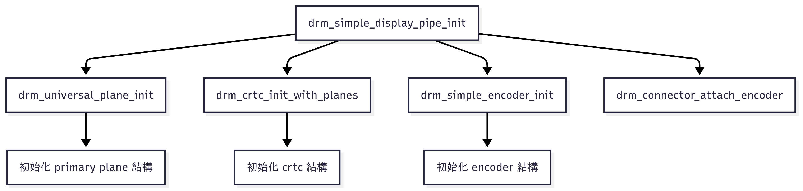

# Trace Note - [DRM] 2025-06-23

## 今日追蹤目標
追蹤 Linux DRM Subsystem 中 drm_simple_display_pipe 的呼叫流程與行為，理解其架構與關聯元件。

## 觀察路徑（檔案 & 函數）
- drivers/gpu/drm/drm_simple_kms_helper.c
  - drm_simple_display_pipe_init

## 進入點理解

## 工具

## 關聯函數 / 結構
- drivers/gpu/drm/drm_simple_kms_helper.c
- struct drm_simple_display_pipe
- struct drm_simple_display_pipe_funcs
- struct drm_plane_helper_funcs
- struct drm_crtc_helper_funcs

## 圖解

graph TD
  A[drm_simple_display_pipe_init] --> B[drm_universal_plane_init]
  A --> C[drm_crtc_init_with_planes]
  B --> D[初始化 primary plane 結構]
  C --> E[初始化 crtc 結構]
  A --> F[drm_simple_encoder_init]
  F --> G[初始化 encoder 結構]
  A --> H[drm_connector_attach_encoder]

## TODO

## 小結
